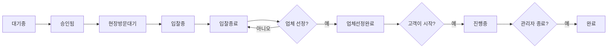

# 프로젝트 시작 기능 개선 가이드

## 📋 개요

입찰 종료 후 고객이 업체를 선택하면 "업체선정완료" 상태가 되고, 프로젝트 시작 버튼을 누르면 고객과 업체 모두에게 축하 메시지가 전송되는 기능을 구현했습니다.

## 🔄 변경된 워크플로우

### 이전 워크플로우
```
1. 대기중 (pending)
2. 승인됨 (approved)
3. 현장방문대기 (site-visit-pending)
4. 입찰중 (bidding)
5. 입찰종료 (bidding-closed)
6. 완료 (completed)  ← 고객이 업체 선택 시 바로 완료
```

### 새로운 워크플로우
```
1. 대기중 (pending)
2. 승인됨 (approved)
3. 현장방문대기 (site-visit-pending)
4. 입찰중 (bidding)
5. 입찰종료 (bidding-closed)
6. 업체선정완료 (bidding-closed + selected_contractor_id 존재)  ← 새로 추가!
7. 진행중 (in-progress)  ← 고객이 프로젝트 시작 버튼 클릭
8. 완료 (completed)  ← 관리자가 프로젝트 종료
```

## ✨ 주요 변경사항

### 1. **관리자 페이지** (`app/admin/quotes/page.tsx`)

#### 변경 내용:
- **"업체선정완료" 상태 표시 추가**
  - `bidding-closed` 상태이면서 `selected_contractor_id`가 있는 경우 "업체선정완료"로 표시
  - 보라색 배지로 다른 상태와 시각적으로 구분

- **"프로젝트 종료" 버튼**
  - `in-progress` 상태일 때만 "프로젝트 종료" 버튼 표시
  - 클릭 시 `completed` 상태로 변경

#### 코드 예시:
```typescript
const getStatusBadge = (status: string, hasSelectedContractor: boolean = false) => {
  // bidding-closed 상태이면서 업체가 선정된 경우 특별 처리
  if (status === 'bidding-closed' && hasSelectedContractor) {
    return (
      <span className="inline-flex items-center px-2.5 py-0.5 rounded-full text-xs font-medium bg-purple-100 text-purple-800">
        <CheckCircle className="w-3 h-3 mr-1" />
        업체선정완료
      </span>
    )
  }
  // ... 기존 코드
}
```

### 2. **고객 대시보드** (`app/customer/dashboard/page.tsx`)

#### 변경 내용:
- **프로젝트 시작 섹션 UI 개선**
  - 그라데이션 배경 (파란색 → 보라색)
  - 명확한 안내 메시지: "프로젝트를 시작해주세요!"
  - 체크리스트 아이콘과 함께 단계별 안내

- **프로젝트 시작 버튼 개선**
  - 더 큰 버튼 크기
  - 그라데이션 효과
  - 호버 시 확대 애니메이션
  - Play 아이콘 추가

#### UI 예시:
```tsx
<div className="mt-6 border-t pt-6 bg-gradient-to-br from-blue-50 to-purple-50 -m-6 p-6 rounded-b-lg">
  <div className="text-center mb-6">
    <h3 className="text-xl font-bold text-gray-900 mb-2">
      프로젝트를 시작해주세요!
    </h3>
    <p className="text-sm text-gray-700 mb-4 flex items-center justify-center gap-2">
      <CheckCircle className="w-5 h-5 text-green-600" />
      업체와 연락하여 공사 일정을 확정하세요
    </p>
  </div>
  <p className="text-sm text-blue-800 mb-4 text-center">
    준비가 완료되고 프로젝트를 시작하실 때 시작버튼을 눌러주세요.
  </p>
  <button onClick={() => handleStartProject(project.id)}>
    <Play className="w-6 h-6" />
    프로젝트 시작
  </button>
</div>
```

### 3. **프로젝트 시작 API** (`app/api/start-project/route.ts`)

#### 변경 내용:
- **고객에게 축하 메시지 전송**
  - 🎉 프로젝트의 시작을 축하드립니다!
  - 그라데이션 헤더 (파란색 → 보라색)
  - 프로젝트 정보 및 다음 단계 안내
  - 프로페셔널한 HTML 이메일 템플릿

- **업체에게 알림 메시지 전송**
  - 🚀 프로젝트가 시작되었습니다
  - 초록색 헤더
  - 프로젝트 정보 및 작업 안내

#### 이메일 템플릿 특징:
```typescript
// 고객용 이메일
subject: '🎉 프로젝트의 시작을 축하드립니다!'
- 그라데이션 헤더
- 하이라이트 박스로 중요 정보 강조
- 다음 단계 안내
- 팁 제공

// 업체용 이메일
subject: '🚀 프로젝트가 시작되었습니다'
- 명확한 프로젝트 정보
- 작업 체크리스트
- 프로페셔널한 톤
```

### 4. **데이터베이스 스키마** (`add-in-progress-status.sql`)

#### 추가된 내용:
```sql
-- 1. 'in-progress' 상태 추가
ALTER TABLE quote_requests 
ADD CONSTRAINT quote_requests_status_check 
CHECK (status IN (
  'pending', 
  'approved', 
  'site-visit-pending', 
  'site-visit-completed', 
  'bidding', 
  'bidding-closed', 
  'quote-submitted',
  'in-progress',  -- ← 새로 추가!
  'completed', 
  'cancelled'
));

-- 2. 타임스탬프 컬럼 추가
ALTER TABLE quote_requests 
ADD COLUMN IF NOT EXISTS project_started_at TIMESTAMPTZ;

ALTER TABLE quote_requests 
ADD COLUMN IF NOT EXISTS project_completed_at TIMESTAMPTZ;
```

## 🚀 배포 방법

### 1. 코드 업데이트
```bash
git pull origin main
npm install
```

### 2. 데이터베이스 마이그레이션
Supabase 대시보드의 SQL Editor에서 `add-in-progress-status.sql` 파일을 실행하세요.

```sql
-- 파일 내용을 복사해서 실행
```

### 3. 애플리케이션 재시작
```bash
npm run build
npm start
```

## 📊 상태 전환 다이어그램



## 🎨 UI/UX 개선사항

### 관리자 페이지
- ✅ "업체선정완료" 상태를 보라색 배지로 표시
- ✅ 상태별로 명확한 액션 버튼 제공
- ✅ 워크플로우 안내 섹션 업데이트

### 고객 대시보드
- ✅ 프로젝트 시작 섹션에 그라데이션 배경 적용
- ✅ 명확한 체크리스트와 안내 문구
- ✅ 눈에 띄는 프로젝트 시작 버튼
- ✅ 호버 효과 및 애니메이션 추가

### 이메일
- ✅ 고객용: 축하 톤의 친근한 메시지
- ✅ 업체용: 프로페셔널한 업무 알림
- ✅ 반응형 HTML 템플릿
- ✅ 브랜드 컬러 적용

## 🔍 테스트 시나리오

### 시나리오 1: 정상 플로우
1. 관리자가 입찰을 종료
2. 고객이 업체를 선택
3. 관리자 페이지에서 "업체선정완료" 상태 확인
4. 고객 대시보드에서 프로젝트 시작 버튼 확인
5. 고객이 프로젝트 시작 버튼 클릭
6. 고객과 업체가 축하 이메일 수신
7. 상태가 "진행중"으로 변경
8. 관리자가 프로젝트 종료
9. 상태가 "완료"로 변경

### 시나리오 2: 엣지 케이스
- 업체 선택 전에 프로젝트 시작 시도 → 버튼 미표시
- 이미 시작된 프로젝트 재시작 시도 → "이미 시작된 프로젝트입니다" 메시지
- 이메일 발송 실패 → 프로젝트는 정상 시작, 콘솔 로그만 기록

## 📝 커밋 히스토리

1. `업체선정완료 상태 추가 및 프로젝트 시작 기능 개선` - 관리자 페이지
2. `고객 대시보드 프로젝트 시작 UI 개선 및 축하 메시지 추가` - 고객 대시보드
3. `프로젝트 시작 시 고객과 업체 모두에게 축하 메시지 전송` - API
4. `데이터베이스에 in-progress 상태 추가` - SQL

## 🐛 알려진 이슈

현재 알려진 이슈 없음

## 💡 향후 개선 사항

- [ ] 프로젝트 진행률 표시 기능
- [ ] 업체와 고객 간 메시징 기능
- [ ] 프로젝트 타임라인 시각화
- [ ] 모바일 푸시 알림 추가

## 📞 문의

문제가 발생하거나 질문이 있으시면 개발팀에 문의해주세요.

---

**작성일**: 2025년 10월 19일  
**버전**: 1.0.0  
**작성자**: Canada Beaver 개발팀
